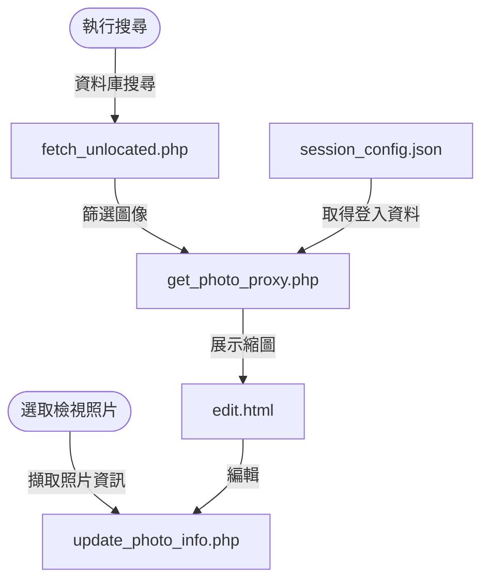

```mermaid
graph TD

A([執行搜尋]) --資料庫搜尋--> B[fetch_unlocated.php]

B--篩選圖像--> C[get_photo_proxy.php]

D[session_config.json]--取得登入資料--> C
C--展示縮圖-->F[edit.html]


G([選取檢視照片]) --擷取照片資訊-->  E[update_photo_info.php]

F--編輯-->E

```
