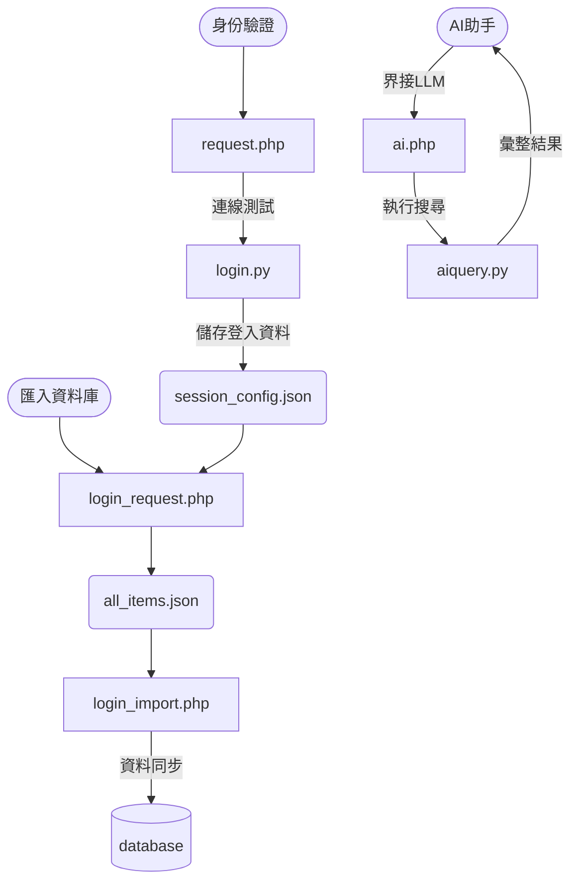

```mermaid
graph TD
    A([身份驗證]) --> B[request.php]
    B --連線測試--> C[login.py]
    C --儲存登入資料--> D(session_config.json)

    
    E([匯入資料庫]) --> F[login_request.php]
    D --> F
    F --> G(all_items.json)
    G --> H[login_import.php]
    H --資料同步--> I[(database)]

    J([AI助手]) --界接LLM-->K[ai.php]
    K--執行搜尋--> L[aiquery.py]
    L --彙整結果--> J
```
